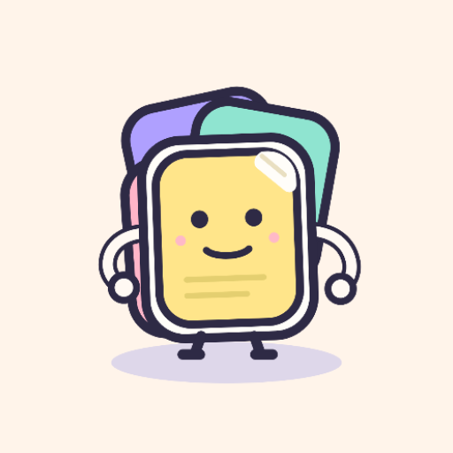

<div align="center">

  

  # StickHub

  **High-Performance Local Sticker Hub & Floating Overlay for Android**

  *Organize, create, cutout, and drop custom stickers across any messaging app seamlessly.*

  [-3DDC84?style=flat&logo=android&logoColor=white)](#)
  [](#)
  [](#)
  [](#)
  [](https://stickhub.web.app)
  [](https://github.com/dev-hkm/StickHub/releases/tag/v5.2.5)
  [](https://github.com/dev-hkm/StickHub/releases/download/v5.2.5/StickHub-v5.2.5.apk)

</div>

---

## 💡 Overview & The Problem (Pain Points)

Modern chat applications (Telegram, Zalo, Messenger, WhatsApp, Discord, Slack...) have fundamentally different, walled-off sticker ecosystems. Users frequently face several frustrating friction points:

1. **Walled Garden Fragmentation:** A favorite sticker saved in Telegram cannot be easily pasted into Messenger or Zalo without saving to the system gallery, losing transparency, or cluttering personal photo albums.
2. **Slow Subject Extraction (Cutout):** Creating a clean transparent sticker from an everyday photo usually requires uploading to third-party web services or heavy photo-editing apps with cumbersome manual lasso tools.
3. **Clipboard Friction:** Copying images from apps like Google Photos or browsers to create stickers often requires multiple manual steps: open app, tap import, select file, crop, and categorize.
4. **Context Switching:** Switching back and forth between a chat conversation and a separate sticker manager disrupts chatting flow.

---

## ⚡ The Solution: StickHub

**StickHub** solves these pain points with an ultra-fast, local-first utility architecture:

* 🎈 **Quick Stickers Floating Overlay:** A floating bubble (`WindowManager TYPE_APPLICATION_OVERLAY`) that hovers over any chat app. One tap expands a compact sticker grid to copy any sticker to the clipboard with zero background bloat.
* 🤖 **On-Device ML Subject Segmentation:** Offline ML Kit subject cutout processor that extracts foreground subjects with crisp contour smoothing in milliseconds without sending any data to the cloud.
* 📋 **Smart Clipboard Staging & Dedup:** Detects clipboard image copies with SHA-256 content deduplication and offers one-tap batch import straight into organized libraries.
* 🎨 **Unified Category Management & Drag-and-Drop:** Intuitive reordering of custom folders and smart filters (`All`, `Favorites`, `Frequent`) with haptic feedback, instantly synced to the overlay in real-time.
* 🔒 **100% Offline & Privacy-First:** Local SQLite database, isolated internal storage sandbox, and edge-to-edge Material You Dynamic Color theme sync.

---

## 📱 Key Features

| Feature | Description |
| :--- | :--- |
| **Floating Quick Stickers** | Custom Android Service overlay powered by hardware-accelerated Views, movable bubble with edge snapping, opacity sliders, and collapsible search/chips. |
| **Studio & Subject Cutout** | On-device ML subject detection + interactive refine tools (erase/restore brush, border stroke, auto-crop, canvas expand). |
| **Smart System Filters** | Dynamic smart collections (`All`, `Favorites`, `Frequent`) alongside custom user categories, freely arrangeable via drag & drop. |
| **Adaptive Theme Sync** | Full support for System, Pure Light, Pure Dark, and Material 3 Dynamic Color palettes synchronized simultaneously across App and Overlay. |
| **4 Library Layout Modes** | Compact Grid, Comfortable Grid, Cover Grid, and Detailed List View for different screen sizes and collection densities. |
| **Complete Offline Backup** | Single-file `.stickhub` archive export and import with integrity verification. |

---

## 🛠️ Tech Stack & Architecture

StickHub is built adhering to modern Android development standards, Clean Architecture, and strict local-first constraints:

* **Language:** 100% Kotlin with Coroutines & StateFlow.
* **Modern UI:** Jetpack Compose (Material 3), Compose Foundation, AnimatedContent, Edge-to-Edge window insets.
* **Overlay Engine:** Android `WindowManager` (`TYPE_APPLICATION_OVERLAY`) utilizing optimized native Views inside an isolated `ForegroundService` for maximum performance and minimal battery footprint.
* **On-Device Machine Learning:** Google ML Kit Subject Segmentation API (local inference, zero server dependency).
* **Local Persistence:** Android SQLite (`SQLiteOpenHelper`) with explicit index optimization, content hashing (`SHA-256`), and atomic transactions.
* **Architecture:** Unidirectional Data Flow (UDF), Repository Pattern, Reducer Pattern (`ClipboardOfferReducer`), and custom UI Drag State Machines (`CategoryDragSession`).
* **Icons & Polish:** Lucide Vector Icons, Material You Dynamic Colors, adaptive monochrome icons with multi-layer punchouts, and tactile haptic feedback policies.

---

## 🏗️ Project Structure

```text
StickHub/
├── app/
│   ├── src/main/
│   │   ├── java/com/hkm/stickhub/
│   │   │   ├── data/
│   │   │   │   ├── cutout/        # ML Kit segmentation & edge contour pipelines
│   │   │   │   ├── db/            # SQLite tables, indexes & migration helpers
│   │   │   │   ├── model/         # Domain models, validators & policies
│   │   │   │   └── repository/    # Local-first single source of truth
│   │   │   ├── service/           # OverlayService, Layout & Appearance Policies
│   │   │   └── ui/
│   │   │       ├── components/    # Reusable Compose sheets, dialogs & chips
│   │   │       ├── library/       # Drag sessions, preferences & layout modes
│   │   │       ├── theme/         # Material 3 palettes, motion & decorations
│   │   │       └── StickHubApp.kt # Primary app entry and screen orchestrator
│   │   └── res/                   # Drawables, adaptive icons & vector assets
│   └── src/test/                  # Comprehensive unit & regression test suites
```

---

## 📥 Download & Installation

The latest signed Release APK is available for download:

* **Version:** 5.2.5 (versionCode 57)
* **Direct Download:** [StickHub-v5.2.5.apk](https://github.com/dev-hkm/StickHub/releases/download/v5.2.5/StickHub-v5.2.5.apk)
* **Android Requirement:** Android 8.0 (API level 26) or higher.

---

## 📄 License & Intellectual Property

Copyright (c) 2026 **Khanh Minh**. All rights reserved.

This software, source code, and associated assets are **proprietary and confidential**. Unauthorized copying, distribution, modification, reverse engineering, or commercial exploitation via any medium is strictly prohibited.

---

<div align="center">

  Crafted with passion by **Khanh Minh**  
  🌐 **Portfolio:** [khanhminh.web.app](https://khanhminh.web.app)

</div>
